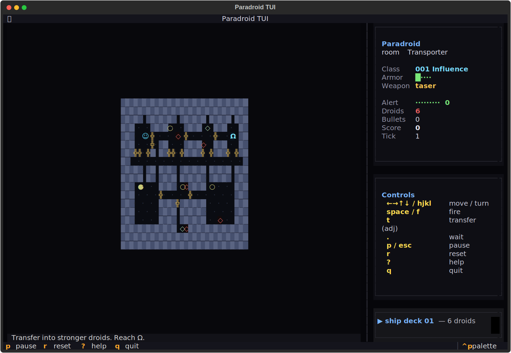
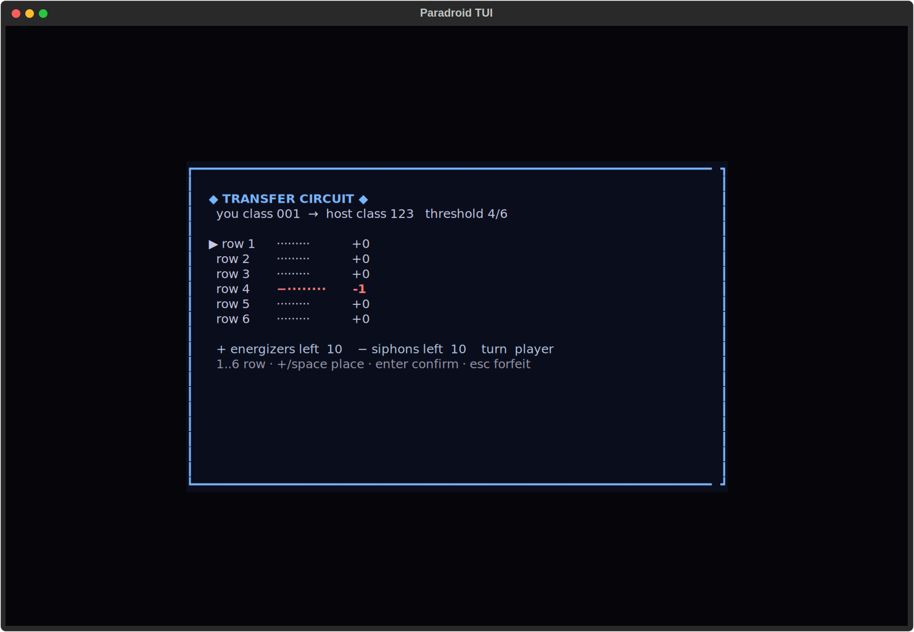

# paradroid-tui
Transfer up. Survive. Clear.





## About
Aboard a drifting freighter, you are a small, unarmed security droid. The others are not unarmed. Transfer-fight into bigger hulls, climb the droid hierarchy, clear the deck. Clean-room terminal Paradroid — Andrew Braybrook's cult C64 masterpiece, reduced to its pure algorithmic essence.

## Screenshots


## Install & Run
```bash
git clone https://github.com/akakabrian/paradroid-tui
cd paradroid-tui
make
make run
```

## Controls
<Add controls info from code or existing README>

## Testing
```bash
make test       # QA harness
make playtest   # scripted critical-path run
make perf       # performance baseline
```

## License
MIT

## Built with
- [Textual](https://textual.textualize.io/) — the TUI framework
- [tui-game-build](https://github.com/akakabrian/tui-foundry) — shared build process
